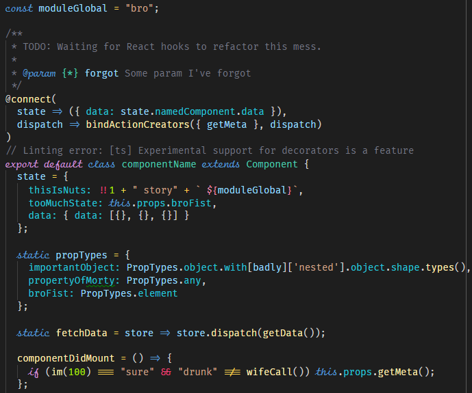
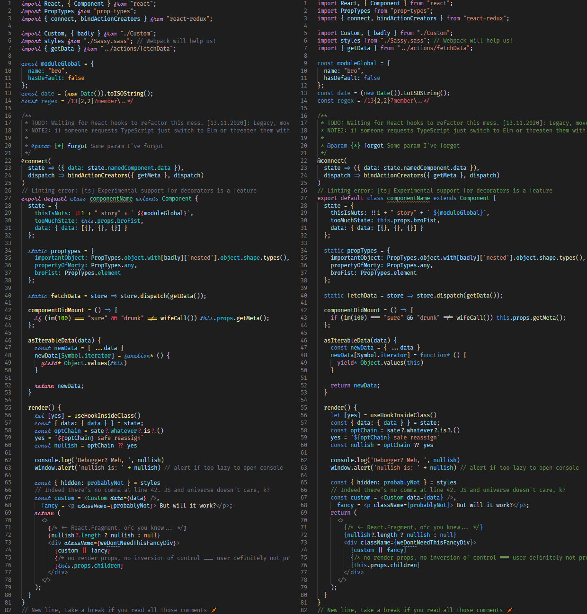

# Dark++ Italic Theme
Enhanced VScode Dark+ theme with support for Fira Code iScript and Fira Code + Operator Mono fonts.


## Comparison
Screenshot of dummy JavaScript/React { **left**: Dark++ Italic, **right**: Dark+(default) }.


## Install
### **IMPORTANT NOTES:**
---
- Every major update to VSCode needs a re add in `workbench.main.css`
- First change in fresh `workbench.main.css` will cause VScode to notify You with corrupt installation warning - just ignore.
---
### [+] Theme installation
In VScode press `ctrl/command + p` to launch the command palette then run command:
```
ext install idbartosz.darkpp-italic
```

### [+] Adding support for **Fira Code iScript**.

1. Download [Fira Code iScript](https://github.com/kencrocken/FiraCodeiScript) (free) and copy fonts to your OS font folder.
2. In VScode press `ctr + ,` to open `User Settings` then add the following options and save changes.
    ```
    {
      ...
      "workbench.colorTheme": "Dark++ Italic",
      "editor.fontFamily": "Fira Code iScript",
      "editor.fontLigatures": true,
      ...
    }
    ```
3. Tweek font appearance by editing VScode internal styles *(optional step)*.
    1. Find in your OS `<path to VScode>/resources/app/ut/vs/workbench/workbench.desktop.main.css`
    2. with administrator rights open `workbench.main.css` and prepend the style below:
        ```
        .mtki {
            font-size: 1.125em;
            font-stretch: ultra-condensed;
        }

       /*!--------------------------------------------------------
         * Copyright (C) Microsoft Corporation. All rights reserved.
        ...
        ```
    3. Close and reopen VScode.


### [+] Adding support for **Fira Code** and **Operator Mono**.

1. Download [Fira Code](https://github.com/tonsky/FiraCode) (free), [Operator Mono](https://www.typography.com/fonts/operator/overview/) (paid) and copy fonts to your OS font folder.
2. In VScode press `ctr + ,` to open `User Settings` then add the following options and save changes.
    ```
    {
      ...
      "workbench.colorTheme": "Dark++ Italic",
      "editor.fontFamily": "Fira Code",
      "editor.fontLigatures": true,
      ...
    }
    ```
3. Add support for Operator Mono fonts by editing VScode internal styles **(required step)**.
    1. Find in your OS `<path to VScode>\resources\app\out\vs\workbench.main.css`
    2. with administrator rights open `workbench.main.css` and prepend the style below:
        ```
        .mtki {
          font-family: Operator Mono;
        }

        /*!--------------------------------------------------------
         * Copyright (C) Microsoft Corporation. All rights reserved.
        ...
        ```
    3. Close and reopen VScode.

## Change log
You can take a look at the change log [here](https://github.com/idbartosz/vscode-darkpp-italic/blob/master/CHANGELOG.md).

## Thanks to
- @tonsky for [Fira Code](https://github.com/tonsky/FiraCode) "monospaced font with programming ligatures"
- @kencrocken for [Fira Code iScript](https://github.com/kencrocken/FiraCodeiScript) "A font mashup to be used in code editors, displaying a script typeface for the italic font style"
- all contributors to the topic ["Free alternative to Operator Mono Italic Theme for VSCode"](https://github.com/mikaelbr/open-source-ideas/issues/10)
