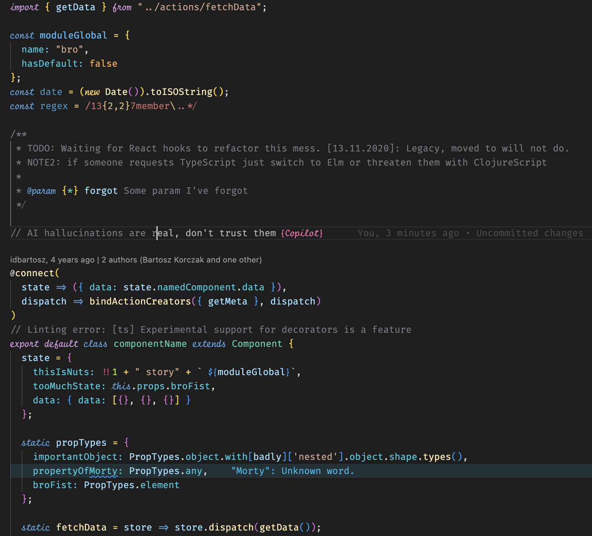
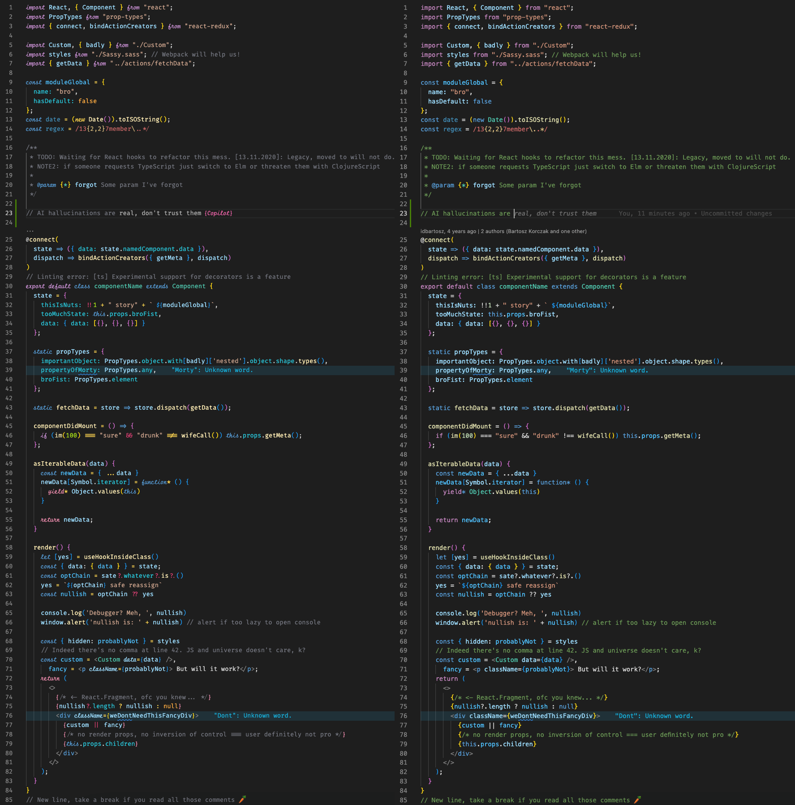

# Dark++ Italic Theme 
Enhanced VSCode Dark+ theme with italic support for **Fira Code iScript**, **Fira Code + Operator Mono** fonts, and **Copilot** hints!

[](https://marketplace.visualstudio.com/items?itemName=idbartosz.darkpp-italic)
[](https://marketplace.visualstudio.com/items?itemName=idbartosz.darkpp-italic)

---

⭐ Like, star, subscribe, and put a comment down below *...couldn't resist*

> 🤩 By far the most complete color theme I've used for JavaScript: italic reserved keywords, different color for every possible difference, nice contrast but well balanced color schema,... BIG FAN [~ Anonymous](https://marketplace.visualstudio.com/items?itemName=idbartosz.darkpp-italic&ssr=false#review-details)

> 😊 Been using this theme since I started using VSCODE and couldn't recommend it more. Keep up the great work! [~ Scott Woeber](https://marketplace.visualstudio.com/items?itemName=idbartosz.darkpp-italic&ssr=false#review-details)

---


## Comparison
Screenshot of dummy JavaScript/React { **left**: Dark++ Italic, **right**: Dark+ (default) } - zoom in to see the details.


## Install
### ⚠️ **IMPORTANT NOTES**
---
- Any major update to VSCode requires re-adding the CSS rules in `workbench.desktop.main.css`
- The first change to the fresh `workbench.desktop.main.css` file will cause VSCode to notify you with a corrupt installation warning - click the gear icon and ignore the message.
---
### [+] Theme installation
In VSCode press `ctrl/command + p` to launch the command palette, then run the command:
```
ext install idbartosz.darkpp-italic
```

### [+] Option A: Adding support for **Fira Code iScript**.

1. Download [Fira Code iScript](https://github.com/kencrocken/FiraCodeiScript) (free) and copy fonts to your OS font folder.
2. In VSCode press `ctr + ,` to open `User Settings` then add the following options and save changes.
    ```
    {
      ...
      "workbench.colorTheme": "Dark++ Italic",
      "editor.fontFamily": "Fira Code iScript",
      "editor.fontLigatures": true,
      "terminal.integrated.fontFamily": "monospace",
      ...
    }
    ```
3. Tweek font appearance and Copilot hints by editing VSCode internal styles *(optional step)*.
    1. Find in your OS `<path to VSCode>\resources\app\out\vs\workbench.desktop.main.css`
      - MacOS: `/Applications/Visual Studio Code.app/Contents/Resources/app/out/vs/workbench/workbench.desktop.main.css`
      - Windows: `C:\Users\<user>\AppData\Local\Programs\Microsoft VS Code\resources\app\out\vs\workbench\workbench.desktop.main.css`
    2. With administrator rights open `workbench.desktop.main.css` and prepend the style below:
        ```css
        /**
        * VSCode will warn you that this change indicates a corrupt installation - click the gear icon and ignore it
        * NOTE: whenever you make changes to this file, you must close all VSCode instances to see the changes
        */

        /* Enhance italic fonts styling */
        .mtki {
            font-size: 1em; /* use 1.25em to increase italic tokens size, 1.25em might look better on Windows machines */
            font-stretch: ultra-condensed;
        }


        /* BEGIN: Enhance Copilot suggestions styling */
        span.mtk1.ghost-text-decoration, span.mtk1.ghost-text {
          color: #B0B0B0 !important;
          font-style: normal !important;
        }

        :nth-last-child(1 of span.mtk1.ghost-text-decoration)::after {
          content: ' {Copilot}';
          color: #FF69B4;
          font-style: italic;
        }
       /* END: Enhance Copilot suggestions styling */

       /*!--------------------------------------------------------
         * Copyright (C) Microsoft Corporation. All rights reserved.
        ...
        ```
    3. Close and reopen VSCode.


### [+] Option B: Adding support for **Fira Code** and **Operator Mono**.

1. Download [Fira Code](https://github.com/tonsky/FiraCode) (free), [Operator Mono](https://www.typography.com/fonts/operator/overview/) (paid) and copy fonts to your OS font folder.
2. In VSCode press `ctr + ,` to open `User Settings` then add the following options and save changes.
    ```
    {
      ...
      "workbench.colorTheme": "Dark++ Italic",
      "editor.fontFamily": "Fira Code",
      "editor.fontLigatures": true,
      ...
    }
    ```
3. Add support for Operator Mono fonts by editing VSCode internal styles **(required step)**.
    1. Find in your OS `<path to VSCode>\resources\app\out\vs\workbench.desktop.main.css`
      - MacOS: `/Applications/Visual Studio Code.app/Contents/Resources/app/out/vs/workbench/workbench.desktop.main.css`
      - Windows: `C:\Users\<user>\AppData\Local\Programs\Microsoft VS Code\resources\app\out\vs\workbench\workbench.desktop.main.css`
    2. With administrator rights open `workbench.desktop.main.css` and prepend the style below:
        ```css
        /**
        * VSCode will warn you that this change indicates a corrupt installation - click the gear icon and ignore it
        * NOTE: whenever you make changes to this file, you must close all VSCode instances to see the changes
        */

        .mtki {
          font-family: Operator Mono;
        }

        /* BEGIN: Enhance Copilot suggestions styling */
        span.mtk1.ghost-text-decoration, span.mtk1.ghost-text {
          color: #B0B0B0 !important;
          font-style: normal !important;
        }

        :nth-last-child(1 of span.mtk1.ghost-text-decoration)::after {
          content: ' {Copilot}';
          color: #FF69B4;
          font-style: italic;
        }
       /* END: Enhance Copilot suggestions styling */

       /*!--------------------------------------------------------
         * Copyright (C) Microsoft Corporation. All rights reserved.
        ...
        ```
    3. Close and reopen VSCode.

## Changelog
You can take a look at the changelog [here](./CHANGELOG.md).

## Special thanks to
- You for using and appreciating this theme! ❤️
- @tonsky for [Fira Code](https://github.com/tonsky/FiraCode) "monospaced font with programming ligatures"
- @kencrocken for [Fira Code iScript](https://github.com/kencrocken/FiraCodeiScript) "A font mashup to be used in code editors, displaying a script typeface for the italic font style"
- all contributors to the topic ["Free alternative to Operator Mono Italic Theme for VSCode"](https://github.com/mikaelbr/open-source-ideas/issues/10)
